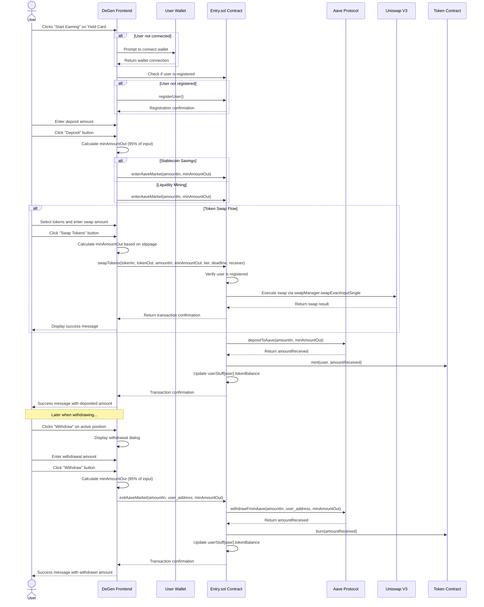
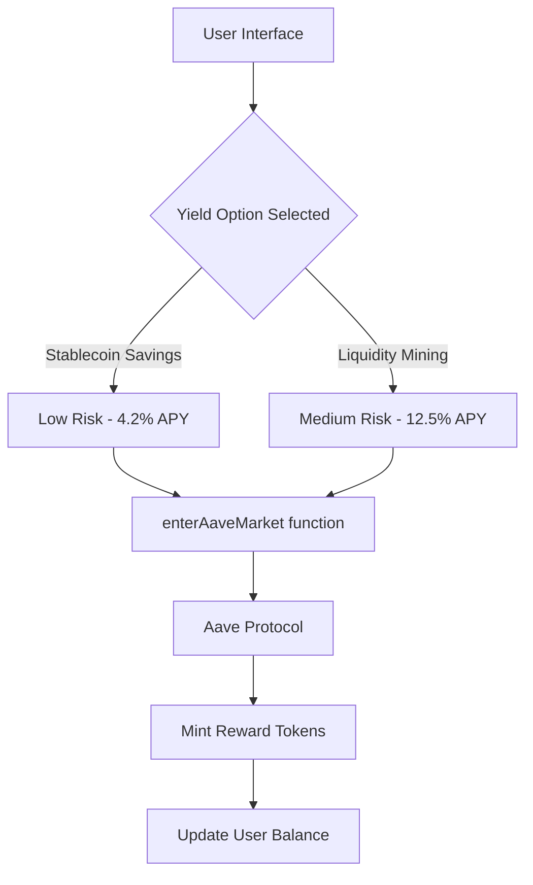

# DeGen Yield Farming Integration

This module integrates the DeFi yield farming capabilities from our smart contracts into the frontend. It allows users to:

1. View available yield farming opportunities
2. Deposit assets into Aave and other DeFi protocols
3. Track their positions and earned yield
4. Withdraw assets when needed

## Smart Contract Integration

The frontend integrates with the `Entry.sol` contract, specifically using the `enterAaveMarket` function to deposit tokens into Aave markets and for Liquidity Mining functionality.

### Key Functions

- `enterAaveMarket(uint256 amountIn, uint minAmountOut)`: Deposits tokens into Aave markets and for Liquidity Mining
- `exitAaveMarket(uint256 amountIn, address to, uint minAmountOut)`: Withdraws tokens from Aave
- `swapTokens(address tokenIn, address tokenOut, uint256 amountIn, uint256 minAmountOut, uint24 tier, uint40 deadline, address receiverAddr)`: Swaps tokens using Uniswap V3 pools

### Implementation Flow



## Frontend Components

- `YieldCard`: Displays available yield farming options and handles deposits/withdrawals
- `EntryService`: Service class that interfaces with the Entry contract
- `TokenSwap`: Component that allows users to swap between different ERC20 tokens

## Setup

1. Add your Entry contract address to `.env.local`:

```
NEXT_PUBLIC_ENTRY_CONTRACT_ADDRESS=0x123...abc
```

2. Ensure you have a connected wallet before attempting to use the yield farming features

## Technical Notes

- The contract requires that users are registered before calling `enterAaveMarket`
- A 5% slippage tolerance is applied to `minAmountOut` by default
- APY rates are fetched from the respective protocols

### Stablecoin Savings vs. Liquidity Mining Implementation

Both the Stablecoin Savings and Liquidity Mining options utilize the same `enterAaveMarket` function in the smart contract, but they are presented as different yield opportunities to users with different risk profiles and APY rates:



#### Technical Implementation Details

1. **Contract Function**: Both options call the same `enterAaveMarket` function in Entry.sol:
   ```solidity
   function enterAaveMarket(uint256 amountIn, uint minAmountOut) public {
       require(userStuff[msg.sender].mAddr != address(0), ErrorLib.Entry__not_Registered());
       uint256 amountReceived = farm.depositToAave(amountIn, minAmountOut);
       // mint Tokens of equivalence to user
       token.mint(msg.sender, amountReceived);
       userStuff[msg.sender].tokenBalance += amountIn;
   }
   ```

2. **Frontend Integration**:
   - The YieldCard component handles both yield options
   - Each option is configured with different display attributes (risk level, APY, lock period)
   - The `contractFunction` parameter identifies which yield option is selected
   - Both options use the EntryService's `enterAaveMarket` method to interact with the smart contract

## Token Swap Component

The `TokenSwap` component allows users to seamlessly swap between different ERC20 tokens using Uniswap V3 liquidity pools. This component is integrated into the dashboard and provides the following features:

- Select from common tokens (DAI, USDC, WETH, WBTC) for input and output
- Set custom slippage tolerance or use automatic calculation
- Choose fee tier based on pool liquidity preferences (0.05%, 0.3%, 1%)
- Specify transaction deadline to protect against pending transactions
- Automatic calculation of minimum output amount based on slippage

The frontend connects to the `swapTokens` function in the Entry contract, which then utilizes the `swapManager` to perform the swap via Uniswap V3's `swapExactInputSingle` function.

### Technical Implementation

1. The frontend component collects all necessary parameters from the user
2. Before executing the swap, it verifies the user is registered
3. The swap is executed through the contract's `swapTokens` function
4. The `SwapManager` contract handles the interaction with Uniswap V3 through the `ISwapRouter` interface
5. Successful swaps are recorded and the user interface is updated accordingly

### Key Frontend Files

- `components/token-swap.tsx`: Main component for the swap interface
- `lib/entry-service.ts`: Service that handles communication with the Entry contract

## Future Improvements

1. Real-time APY updates from on-chain data
2. Position tracking and visualization
3. Yield history charts
4. Multiple asset support
5. Portfolio rebalancing tools
6. Additional yield strategies with different risk-reward profiles
7. Gas fee optimization for smaller deposits
8. Cross-chain yield farming using CCIP as mentioned in Entry.sol comments

## Withdrawal Process

Users can withdraw their assets from yield farming positions through the following steps:

1. Click the "Withdraw" button on any active yield farming position
2. Enter the amount to withdraw in the withdrawal dialog
3. Click "Withdraw" to confirm the transaction

The system will:
1. Calculate a safe `minAmountOut` (95% of the withdrawal amount to account for slippage)
2. Call the `exitAaveMarket` function on the Entry contract
3. The contract will withdraw tokens from Aave, burn the equivalent reward tokens, and update the user's balance
4. Display a confirmation message to the user

```solidity
function exitAaveMarket(uint256 amountIn, address to, uint minAmountOut) public {
    require(userStuff[msg.sender].mAddr != address(0), ErrorLib.Entry__not_Registered());
    uint256 amountReceived = farm.withdrawFromAave(amountIn, to, minAmountOut);
    // burn Tokens of equilavalnce to user
    token.burn(amountReceived);
    userStuff[msg.sender].tokenBalance -= amountIn;
}
```

## Status

As of June 2025, both Stablecoin Savings and Liquidity Mining features are fully implemented and functional in the frontend. Users can deposit assets and start earning yield from both strategies through the unified `enterAaveMarket` function, and withdraw their assets using the `exitAaveMarket` function in the Entry.sol contract.
